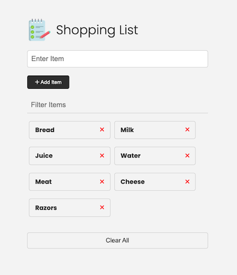

# README

## Description

These are the local files I created while following the full 38 hour Traversy Media course [Modern JavaScript From The Beginning 2.0](https://www.traversymedia.com/modern-javascript-2-0).

- [Project repository](https://github.com/bradtraversy/javascript-sandbox)

I cloned the project repo to start each lesson with scaffolding like HTML files and stylesheets. For there I followed the tutorials and created everything from scratch. My version of the repo contains a handful of directories for self-contained projects like the Shopping List.

### Technologies used

- JavaScript

## To install and run from repo

Everything is run locally using the Live Server VSCode extension.

### Notes about tutorial

## Screenshots

